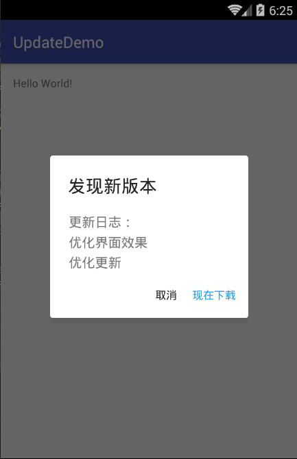
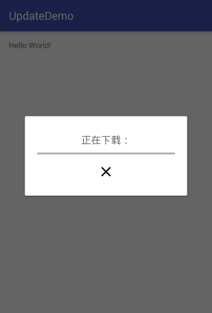
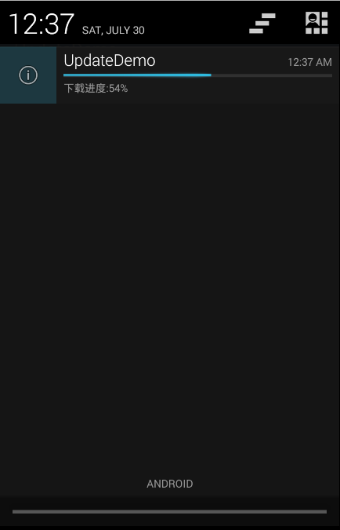

# UpdateFun更新库

UpdateFun是一个[fir.im](http://fir.im/)的Android更新下载模块，在[fir.im](http://fir.im/)上上传自己的APP后接入该库即可实现检查更新下载

[](https://github.com/hugeterry/UpdateDemo/blob/master/LICENSE.txt)
[ ](https://bintray.com/hugeterry/update/UpdateFun/_latestVersion)

    


## 用法

### Step 1

在gradle文件中加入下面的依赖:

```groovy
dependencies {
    compile 'cn.hugeterry.updatefun:updatefun:2.0.6'
}
```

如果你使用Maven，那么加入下面的依赖：

```xml
<dependency>
  <groupId>cn.hugeterry.updatefun</groupId>
  <artifactId>updatefun</artifactId>
  <version>2.0.6</version>
  <type>pom</type>
</dependency>
```

### Step 2

在主界面activity的onCreate()中加上以下语句进行初始化(请放在setContentView()方法的后面):

```java
UpdateKey.API_TOKEN = "写上你fir.im账号的API_TOKEN";
UpdateKey.APP_ID = "写上APP的应用ID";
//下载方式:
//UpdateKey.DialogOrNotification=UpdateKey.WITH_DIALOG;通过Dialog来进行下载
//UpdateKey.DialogOrNotification=UpdateKey.WITH_NOTIFITION;通过通知栏来进行下载(默认)
UpdateFunGO.init(this);
```

### Step 3

在主界面Activity中加上以下语句：

```java
 @Override
    protected void onResume() {
        super.onResume();
        UpdateFunGO.onResume(this);
    }
  @Override
     protected void onStop() {
         super.onStop();
         UpdateFunGO.onStop(this);
     }
```

### Step 4 (2.0.6以上版本必须加，兼容Android 7.0+,非Android 7.0的手机也要加)

在app文件夹下的build.gradle里添加:

```groovy
android {
    defaultConfig {
        ...
        resValue "string", "updatefun_provider_file_authorities", "<packageName>.fileprovider"
    }
}
```

`<packageName>`为你的应用包名</b>

大功告成，好好享用吧

## 其他功能

### 手动更新（需1.8.4以上版本）[案例代码](sample/src/main/java/cn/hugeterry/updatedemo/ManualUpdateActivity.java)

请确保在你的app已添加依赖(见用法Step 1),
并已经写上你fir.im账号的API_TOKEN以及APP的应用ID(见用法Step 2)

在需要手动更新时调用:
```java
UpdateFunGO.manualStart(this);
```
并在手动更新的当前Activity添加上以下代码：
```java
 @Override
    protected void onResume() {
        super.onResume();
        UpdateFunGO.onResume(this);
    }
  @Override
     protected void onStop() {
         super.onStop();
         UpdateFunGO.onStop(this);
     }
```
即可实现手动更新


## Demo
[http://fir.im/updatefun](http://fir.im/updatefun)


## LICENSE


    Copyright 2016 HugeTerry.

    Licensed under the Apache License, Version 2.0 (the "License");
    you may not use this file except in compliance with the License.
    You may obtain a copy of the License at

       http://www.apache.org/licenses/LICENSE-2.0

    Unless required by applicable law or agreed to in writing, software
    distributed under the License is distributed on an "AS IS" BASIS,
    WITHOUT WARRANTIES OR CONDITIONS OF ANY KIND, either express or implied.
    See the License for the specific language governing permissions and
    limitations under the License.


